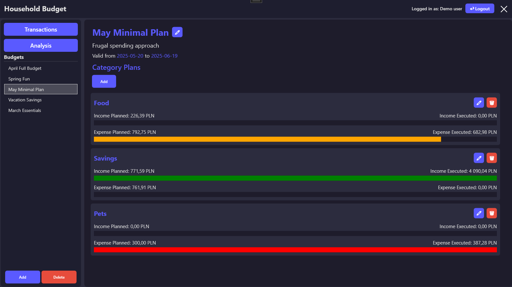

# 📟 HouseholdBudget

**HouseholdBudget** is a .NET-based application designed to help users manage their personal or household finances with clarity and control. It allows you to track income and expenses, categorize transactions, monitor financial trends, and generate monthly summaries.


**Authors:**  
- Maria Mrozek – 322956  
- Michał Kuchnicki – 317129  

---

## 🚀 Features

* 💸 **Transaction Management**
  Add and update income or expense entries, linked to specific categories and dates.

* 📁 **Custom Categories**
  Create, rename, and delete user-specific categories for better financial organization (e.g., Food, Transport, Rent).

* 📊 **Monthly Summaries**
  View comprehensive summaries of income and expenses for each calendar month.

* 📈 **Daily Trends Visualization**
  Analyze financial patterns over time with daily budget point data.

* 👥 **User Session Support**
  Each user's data is securely scoped to their own account context.

* 🌐 **Multi-Currency Support**
  Currency handling with exchange rate integration (customizable via exchange provider).

---

## 🖼️ Screenshots

### 💰 Transaction List View


The main transaction list serves as the financial activity hub of the application. It provides a clear, chronological view of all income and expense entries recorded by the user. Each transaction is associated with a category, date, amount and more making it easy to review past spending or income. Integrated filtering options allow users to narrow down transactions by date range, category, transaction type (income/expense) and more enabling more efficient navigation and financial oversight.

---

### 📊 Budget Analysis


This screen provides a visual breakdown of your financial trends using interactive charts powered by ScottPlot. It helps users monitor how their spending evolves over time and identify key patterns in monthly expenses. Each chart is dynamically generated based on user-entered data, allowing for tailored financial insight and helping inform better budgeting decisions. It's an essential tool for anyone looking to better understand and control their personal finances.

---

### 🗕️ Budget Overview


The budget overview screen gives a high-level comparison between planned and actual spending. Users can define monthly spending limits per category and then monitor how their real-world expenses align with those limits. This section is particularly useful for goal-oriented users who want to proactively manage budgets across different life areas such as groceries, rent, or entertainment. The overview is presented in a tabular format with visual indicators for budget overruns.

---

## 🏗️ Project Structure

The app follows a clean, layered architecture with separation of concerns:

```
HouseholdBudget/
├── Core/
│   ├── Models/              # Domain models (Category, Transaction, etc.)
│   ├── Services/            # Business logic implementations
│   ├── Services.Interfaces/ # Service contracts
│   └── UserData/            # Session and user context
├── Tests/                   # Unit tests for core services
└── DesktopApp               # Fully functional desktop app
```

---

## ⚙️ Technology Stack

* **Frontend:** Windows Forms (.NET)
* **Backend:** C# 12 with Entity Framework Core (SQLite)
* **UI Charts:** ScottPlot
* **Architecture:** Clean architecture with Dependency Injection and application bootstrapper
* **Testing:** xUnit, Moq, FluentAssertions

---

## 🧪 Unit Testing

The project includes unit tests under the `HouseholdBudget.Tests` project, following AAA (Arrange–Act–Assert) pattern.

Example:

```csharp
[Fact]
public async Task CreateCategoryAsync_ShouldAddAndReturnCategory()
{
    var service = new LocalCategoryService(_repoMock.Object, _sessionMock.Object);
    var category = await service.CreateCategoryAsync("Utilities");

    category.Name.Should().Be("Utilities");
    _repoMock.Verify(r => r.AddCategoryAsync(It.IsAny<Category>()), Times.Once);
}
```

## 📅 Planned Features

The following features are planned or currently under development:

* ✉️ Exporting financial data to formats such as CSV or Excel
* 🧠 AI-based financial insights and spending analysis
* 🗃️ OCR support to extract data from scanned receipts
* ⏰ Notification system for budget limits, due dates, etc.

---

## ⚠️ Limitations / Work in Progress

The system currently supports user registration and multiple accounts, but some user account features are incomplete:

* Cannot delete an existing user account
* Cannot change user email, default currency, or password after account creation

---

## 🛠️ Getting Started

### Prerequisites

* [.NET 8 SDK](https://dotnet.microsoft.com/en-us/download)
* Visual Studio 2022+ or any .NET-compatible IDE

### Steps

1. **Clone the repository**

   ```bash
   git clone https://github.com/your-username/HouseholdBudget.git
   cd HouseholdBudget
   ```

2. **Apply database migrations**
   If you're using the local database provider (SQLite), navigate into the `.Core` folder:

   ```bash
   cd HouseholdBudget.Core
   ```

   Then run the following command to create the database:

   ```bash
   dotnet ef database update --startup-project ../HouseholdBudget.DesktopApp
   ```

3. **Build and run the app**

   ```bash
   cd ..
   dotnet build
   dotnet run --project HouseholdBudget.DesktopApp
   ```
   
---

### 🔑 Demo User

To explore the app without creating an account, you can log in using the built-in demo user:

```txt
Email:    demo@example.com  
Password: DemoPassword123#
```

---

This account includes prefilled sample data (categories, transactions, and budget summaries) to help you quickly understand the app's features.

## 🧱 Challenges Faced During Development
Building HouseholdBudget provided many learning opportunities and came with its share of challenges:

* ⚙️ Entity Framework Core & Data Modeling
Working with EF Core and configuring the data layer was initially difficult, especially with regard to concurrency issues and model relationships. Some structural changes were needed to simplify interactions — for example, replacing a Currency object with a simple currency code string inside transaction records.

* 🧩 WPF Application Complexity
Although powerful, building a polished Windows desktop application using WPF presented its own challenges. Certain aspects felt unintuitive or cumbersome compared to web-based development, requiring additional time for debugging and layout fine-tuning.

* 🧠 Codebase Maturity Variance
The Core project was carefully designed and refined with well-defined services and interfaces. While the desktop UI is functional and visually clean, some parts could benefit from further architectural improvements to enhance long-term maintainability and scalability.
